# PostgreSQL-e-pgAdmin-com-Docker-Compose
PostgreSQL e pgAdmin com Docker Compose
Caso não tenha o `docker` e o `docker-compose`, pode ser instalado com:
```bash
sudo snap install docker
sudo apt  install docker-compose
```
#### Checar a instalação do docker.

```bash
docker --version
```
O resultado esperado é a versão do Docker instalado, semelhante a este print:
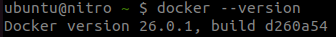

A segunda etapa é criar uma rede para nossos Containers, geralmente gosto de adotar essa estratégia para manter os containers de um projeto, dentro de uma rede especifica para ele, rode o seguinte comando:

```bash
docker network create local-network
```
Após executar o comando, você deve ver um ID alfanúmerico no terminal, semelhante a este:

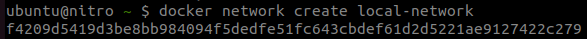

#### Configurando o PostgreSQL com Docker
Agora, para iniciar nossa configuração, vamos começar criando um arquivo Docker Compose para definir o serviço do PostgreSQL.

Crie um diretório em algum local da sua preferência e crie um arquivo chamado nomeado como **docker-compose.yml** e adicione o seguinte conteúdo:


```bash
version: "3.8"
services:
  dcs-postgres:
    image: postgres:15.3-alpine
    container_name: dcs-postgres
    restart: always
    environment:
      POSTGRES_PASSWORD: password
      POSTGRES_USER: postgres
    ports:
      - 5432:5432
    volumes:
      - ./docker-data/postgres-data:/var/lib/postgresql/data

networks:
  default:
    name: local-network
    external: true
```

Vamos conferir cada propriedade e entender o que fizemos.
| | |
|--|--|
|image | Definimos a imagem Docker e versões do Postgre que será utilizada.|
|container_name	| Definimos um nome para o container.|
|restart |	Definimos a estratégia de reinicialização, com o valor always, o serviço sempre será reiniciado caso alguma falha aconteça.|
|environment | Definimos duas variáveis para serem atribuídas na inicialização do Postgres, senha e usuário de acesso.|
|ports | Definimos a porta publica e interna do nosso container para conexão.|
|volumes | Definimos o local onde os arquivos do Postgres devem ser espelhados, caso nosso serviço seja interrompido, os dados armazenados serão preservados no nosso diretório local data/postgres.|
|networks | Definimos o nome da rede default em que os serviços deste Compose serão executados, informando o nome da rede em name e dizendo que é uma rede externa. Isso é importante para mantermos os containers na mesma rede e compartilhar informações entre si.|

Agora com o serviço definido, podemos executar nosso Compose, no terminal execute:

```bash
docker-compose -f docker-compose.yml up
```
Após rodar o comando, o Docker vai fazer o download da imagem do PostgreSQL, iniciar o container e o serviço do PostgreSQL.

No final, você deve ver uma imagem semelhante a esta.
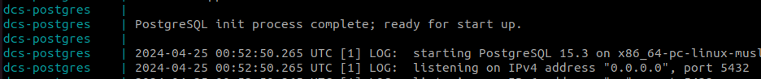


Agora o que resta é testar a conexão.

Podemos usar alguma IDE para conectar ao servidor, o instalador do pgAdmin é uma opção, entretando você pode usar o container pré-configurado do pgAdmin web, uma alternativa para quem não quer instalar o executável.

Vamos configurar o serviço do pgAdmin no Docker Compose.


#### Configurando o pgAdmin via Docker
Para usar o pgAdmin com Docker, vamos utilizar o container disponível aqui no [DockerHub](https://hub.docker.com/r/dpage/pgadmin4/), para isso, vamos definir configurar um novo serviço no Compose.

Atualize seu arquivo yml com o conteúdo a seguir:
```bash
version: "3.8"
services:
  dcs-postgres:
    image: postgres:15.3-alpine
    container_name: dcs-postgres
    restart: always
    environment:
      POSTGRES_PASSWORD: password
      POSTGRES_USER: postgres
    ports:
      - 5432:5432
    volumes:
      - ./docker-data/postgres-data:/var/lib/postgresql/data
  dcs-pgadmin:
    image: dpage/pgadmin4:latest
    container_name: dcs-pgadmin
    user: root
    restart: always
    depends_on:
      - dcs-postgres
    environment:
      PGADMIN_DEFAULT_EMAIL: user@localhost.com
      PGADMIN_DEFAULT_PASSWORD: password
    ports:
      - 8080:80
    volumes:
      - ./docker-data/pgadmin-data:/var/lib/pgadmin

networks:
  default:
    name: local-network
    external: true
```
O que fizemos agora foi adicionar um novo serviço chamado dcs-pgadmin, usando praticamente as mesmas propriedades do serviço anterior, com pequenas modificações, vamos as novas proriedades:
|||
|--|--|
|depends_on | Definimos que este serviço depende do serviço dcs-postgres, ou seja, este novo serviço será iniciado somente após serviço do PostgreSQL já ter iniciado.|
|environment | Definimos propriedades para autenticação no pgAdmin. Quando você abrir o pgAdmin no seu navegador, será solicitado um e-mail e senha.|
|ports | Definimos que a porta 80 do container será acessível pela porta 8080 em nosso ambiente local.|

Agora para testar, pare o container atual (CTRL+C) no seu terminal e execute novamente o comando para subir o compose.

O resultado no seu terminal deve ser semelhante a este:
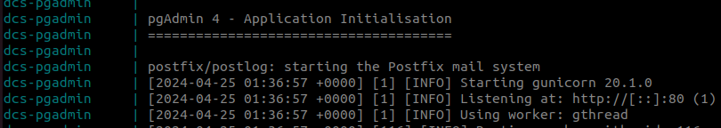


Para testar se o serviço do pgAdmin está funcionando acesse http://localhost:8080 no seu navegador, haverá uma tela de autenticação, você deverá informar o usuário e senha que defimos no Composer e se preferir você poderá trocar o idioma da aplicação.

A tela deve ser semelhante a esta:


Autenticado, agora vamos adicionar nosso servidor e testar a conexão.

#### Adicionando servidor no pgAdmin
Para adicionar o pgAdmin, na aba Object Explorer, clique com o botão direito no item Servers, após na opção Registrar e Servidor. Se preferir, também há um atalho nos links rápidos.
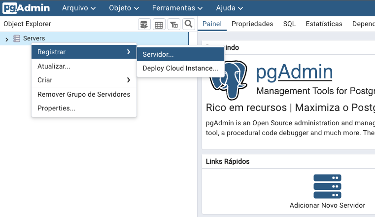

Uma janela deve abrir para você configurar o serviço, na aba General informe um nome para identificar sua conexão, neste tutorial chamei de **Server Projeto A**.
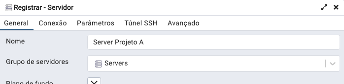

Mova para a aba Conexão e no campo host name informe o nome do container do Postgre, no campo username o usuário, a senha no respectivo campo e clique em Salvar para continuar.

Estes valores foram definidas no Compose.
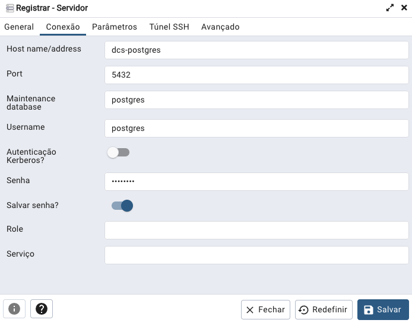


Existem também outras configurações úteis, mas para este cenário, vamos configurar o essencial para começar a testar o PostgreSQL.

Após salvar, se você seguiu todas as etapas até aqui, o resultado é um Dashboard com as informações do banco de dados que você está conectado.
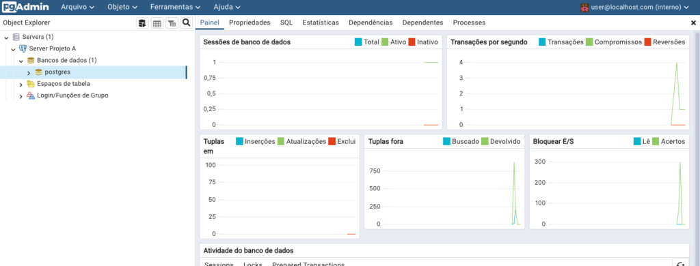

Por fim, agora vamos criar nosso database, clique com botão direito em Bancos de dados
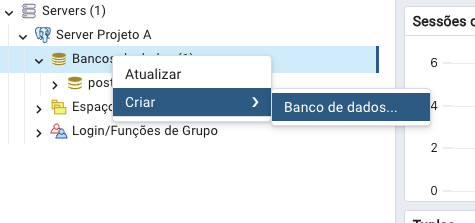

Informe um nome para seu banco de dados e clique em Salvar para continuar.
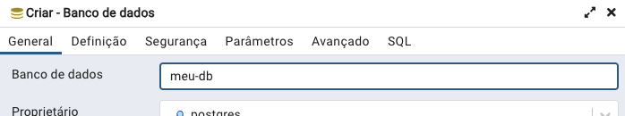

Finalizado, na aba Object Explorer, você deverá ver o seu novo banco de dados listado.  
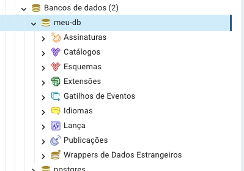

Pronto! Chegamos ao fim e agora você tem um ambiente com PostgreSQL e o pgAdmin web.

Agora, sempre que precisar trabalhar com estas ferramentas, basta abrir o terminal na pasta que utilizou para adicionar o docker-compose.yml e executar este comando:

```bash
docker-compose -f docker-compose.yml up
```
#### Próximos passos
Agora que concluímos a configuração do PostgreSQL e o pgAdmin com Docker Compose, podemos reutilizar este ambiente sem precisar ter novas instalações, basta o Docker. 


##### Creditos
[www.danieldcs.com](https://www.danieldcs.com/postgresql-e-pgadmin-com-docker-compose/)
